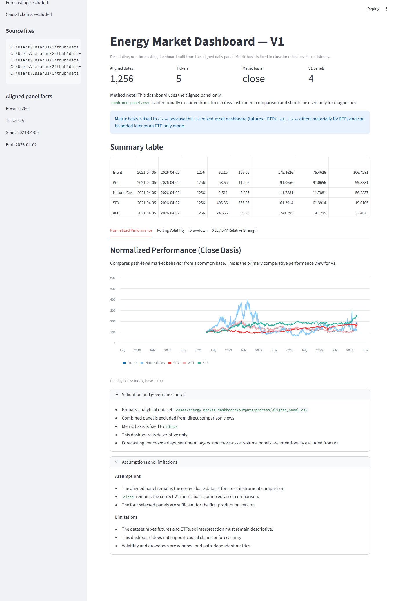

# Data Analysis Lab

A **process-driven data analysis portfolio** demonstrating how raw datasets are transformed into structured, evidence-based insights.

This repository focuses on **analytical discipline, reproducibility, and decision-oriented thinking**.

---

## Core Framework

All case studies follow a consistent lifecycle:

**ASK → PREPARE → PROCESS → ANALYZE → ACT**

Each phase is explicitly documented to reflect real-world analytical workflows.

---

## What This Repository Demonstrates

- structured problem definition  
- rigorous data validation  
- controlled data transformation  
- clear exploratory analysis  
- disciplined interpretation (non-causal)  

The goal is not to showcase tools, but to demonstrate **how analytical work is actually performed**.

---

## Interactive Dashboard (V1)

The repository includes a Streamlit-based analytical dashboard:

**Energy Market Dashboard — V1**

- Built from aligned daily dataset  
- Uses consistent `close` price basis  
- Strictly descriptive (no forecasting)  
- Reproducible from pipeline outputs  

### Panels:
- Normalized Performance  
- Rolling Volatility (20-day annualized)  
- Drawdown  
- XLE / SPY Relative Strength  

Example view:



---

## How to Read This Repository

If you are reviewing this as a recruiter or collaborator:

1. Open any case in `/cases/`
2. Follow the lifecycle:
   - `00_ask/` → problem definition  
   - `01_prepare/` → dataset validation  
   - `02_process/` → transformations  
   - `03_analyze/` → structured findings  
   - `04_act/` → interpretation and boundaries  
3. Optionally review the notebook or dashboard

Each case is designed to be **traceable from question → conclusion**.

---

## Repository Structure


data-analysis-lab/
│
├─ cases/
│ ├─ energy-market-dashboard/
│ ├─ spdr-sector-etfs/
│ ├─ hungarian-inflation-bond-vs-alternatives/
│ ├─ retail-sales-eda/
│
├─ data/
│ ├─ raw/
│ ├─ processed/
│ ├─ interim/
│ └─ archive/
│
├─ docs/
│ ├─ templates/
│ ├─ ANALYTICAL_METHOD.md
│ └─ RUN_GUIDE.md
│
├─ src/
│ ├─ common/
│ ├─ cases/
│ └─ adhoc/
│
├─ learning/
│ └─ cheatsheets/
│
├─ requirements.txt
├─ LICENSE
└─ README.md


---

## Analytical Lifecycle

### 1. ASK — Problem Definition

- Define the analytical question  
- Clarify decision context  
- Establish scope and constraints  

Output: clearly defined objective  

---

### 2. PREPARE — Data Validation

- Schema validation  
- Missingness checks  
- Duplicate detection  
- Data integrity verification  

Output: validated dataset ready for transformation  

---

### 3. PROCESS — Controlled Transformation

- Minimal, explicit data transformations  
- Feature engineering where necessary  
- Preservation of raw data  

Output: analysis-ready dataset  

---

### 4. ANALYZE — Structured Exploration

- Aggregations and distributions  
- Comparative analysis (categories, segments, time)  
- Pattern identification  

Outputs:
- tables  
- charts  
- structured findings  

---

### 5. ACT — Interpretation Layer

- Translate findings into structured implications  
- Identify areas for further investigation  
- Define analytical boundaries  

Important:
- No causal claims  
- No forecasting  
- No overinterpretation  

---

## Case Studies

### Energy Market Dashboard (NEW)

- Multi-asset analysis: Brent, WTI, Natural Gas, XLE, SPY  
- Aligned daily panel construction (common date window)  
- Metric validation (`close` vs `adj_close`)  
- Four-panel analytical system:

  1. Normalized performance  
  2. Rolling volatility  
  3. Drawdown  
  4. Relative strength (XLE / SPY)

- Interactive Streamlit dashboard (V1)

Focus: **cross-asset energy market structure (descriptive, non-causal)**

---

### SPDR Sector ETFs

- Relative performance analysis  
- Market structure classification  
- Sector leadership dynamics  

Focus: **cross-sectional financial analysis**

---

### Hungarian Inflation Bond vs Alternatives

- Real return comparison  
- CPI integration  
- Scenario-based evaluation  

Focus: **macro + investment analysis**

---

### Retail Sales EDA

- Revenue and profit distribution  
- Loss concentration analysis  
- Discount–profit association  

Focus: **transaction-level exploratory analysis**

---

## Code Organization

### `src/common/`
Reusable utilities:
- validation  
- I/O  
- shared transformations  

---

### `src/cases/`
Case-specific pipelines:
- prepare scripts  
- process pipelines  
- analysis logic  

---

### `src/adhoc/`
Temporary development scripts  
(not part of production workflow)

---

## Reproducibility

This repository emphasizes **structural reproducibility**:

- Analytical steps are documented in Markdown  
- Code reflects each lifecycle phase  
- Raw datasets may not be included  
- Outputs can be regenerated from scripts or dashboards  

---

## Environment Setup

```bash
pip install -r requirements.txt
Example Run
python src/cases/hungarian-inflation-bond-vs-alternatives/process/run_process_full.py
python src/cases/hungarian-inflation-bond-vs-alternatives/analyze/run_analyze_full.py

Run the dashboard:

streamlit run cases/energy-market-dashboard/app/app.py
Purpose

This repository is designed to demonstrate:

disciplined analytical workflows
reproducible data pipelines
structured thinking under constraints
translation of analysis into interactive dashboards

It serves as a portfolio for data analyst and financial analyst roles.

License

MIT License